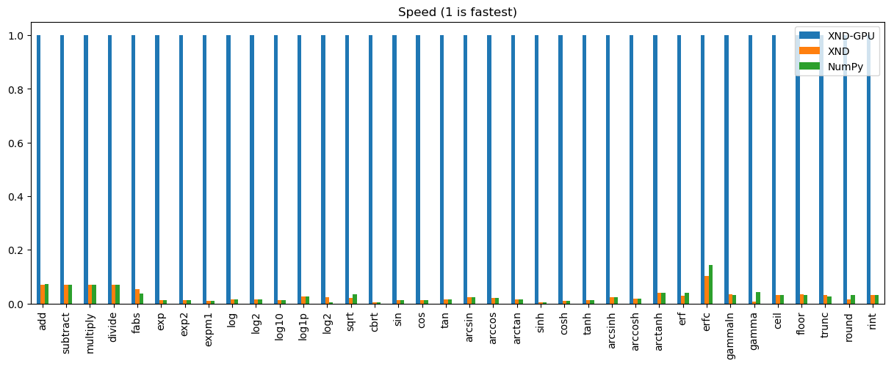

# XND-GPU

XND-GPU provides [gumath](https://github.com/plures/gumath) kernels that run on
the GPU.

## API

For the data to be accessible by the GPU, we cannot use general XND containers,
which currently allocate memory only accessible by the CPU. The `xnd_gpu`
function returns an XND container whose data memory has been allocated in the
[Unified Memory](https://devblogs.nvidia.com/unified-memory-in-cuda-6), which
provides a single memory space accessible by the GPU and the CPU. Under the
hood, we use `xnd.from_buffer` to get an XND container whose data points to this
memory. As shown below, `xnd_gpu` can be called with a `from_buffer=a` argument,
which will copy the content of the NumPy array `a`, or with a `empty_like=a`
argument, which will just allocate the memory needed to store an array of `a`'s
size:

```python
import numpy as np
from xnd_gpu import xnd_gpu

a = np.arange(1_000_000, dtype='float64') # data is allocated in the CPU memory
x = xnd_gpu(from_buffer=a) # data is copied from the CPU to the GPU memory
r = xnd_gpu(empty_like=a) # data is allocated in the GPU memory
```

GPU functions live in the `gpu_func` module. Successive GPU function calls:
- do not copy data back to the CPU,
- are non-blocking.

This allows for maximum performances. When CPU data access is needed,
`gpu_synchro()` has to be called to ensure all the GPU computations are done.
But the data still lives in the GPU memory. Thanks to the unified memory, it is
only when the CPU accesses the data that it is copied back.

```python
from gpu_func import gpu_sin, gpu_cos
from xnd_gpu import gpu_synchro

gpu_sin(x, r) # the result is stored in r
# data remains in the GPU memory
gpu_cos(r, r) # the result is stored in-place
gpu_synchro() # wait for all the GPU computations to finish
print(r) # data is copied from the GPU upon CPU access, thanks to unified memory
```

## Benchmark

Each operation was run in a loop for at least 10 seconds on arrays of 10M
`float64` elements. For XND-GPU, the data remains on the GPU (no copy between
CPU and GPU). XND and NumPy/SciPy allocate memory for the result, but XND-GPU
doesn't since it's preallocated and passed as argument. NumPy and SciPy don't
use MKL. The following hardware was used:

- CPU: Intel Broadwell, 1 core at 3 GHz
- GPU: Quadro P2000, 1024 CUDA cores at 1.48 GHz



## Install

In the `xnd-gpu` directory:

```bash
$ make
```

will compile and install for a (real) GPU. If you don't have a GPU, you can compile for the CPU:

```bash
$ make cpu
```
